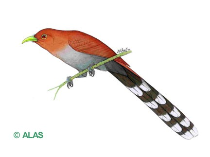

```{r setup, include=FALSE}
knitr::opts_chunk$set(echo = TRUE)
```


\
\
\
\
 <center>**Cuco ardilla (*Piaya cayana*)**<center>
\
\
\
\
 <center><center>
\
\
 <p align="justify">
 **Descripción**: El cuco ardilla es un ave principalmente solitaria, aunque también puede estar en pareja. Puede formar parte de bandadas mixtas, pero busca alimento lejos de la bandada. Su hábito de forrajeo es en el dosel y subdosel, donde salta de rama en rama con movimientos parecidos a una ardilla. Para brincar de árbol en árbol realizan un largo desplazamiento con un sólo aleteo (Fitzgerald et al., 2011).
Su dieta se basa en artrópodos, específicamente hormigas soldado que encuentran en nidos en los árboles (Willis y Eisenmann, 1979), aún no se ha observado que consuman alimento en el suelo o en el sotobosque. En cuanto a su reproducción, los machos cortejan a la hembra ofreciendo comida en el nido antes de la cópula.
 </p>
\
\
<p align="justify">
**Distribución**: Del NO de México hasta el N de Argentina. Son residentes a lo largo de todo el país desde el nivel del mar hasta los 2450m en raras ocasiones, son comunes aunque las parejas tienden a estar esparcidas (Stiles & Skutch, 2007). 
</p>
\
\

<p align="justify">
**Hábitat**: Los nidos son puestos en el subdosel, arbustos o en árboles y tapados con lianas o ramas. La incubación dura aproximadamente 17 días y hay comportamiento de aprovisionamiento (Studer y Barcena-Goyena, 2018).
</p>
\
\

<p align="justify">
**Bibliografía**

Fitzgerald, J., T. S. Schulenberg, and G. F. Seeholzer (2011). Squirrel Cuckoo (Piaya cayana), version 1.0. In Neotropical Birds Online (T. S. Schulenberg, Editor). Cornell Lab of Ornithology, Ithaca, NY, USA. https://doi.org/10.2173/nb.squcuc1.01


Stiles, F. G., & Skutch, A. F. (2007). Guía de aves de Costa Rica. Editorial INBio  

Studer, A., & Barcena-Goyena, B. (2018). Nesting biology of Squirrel Cuckoo Piaya cayana at two localities in eastern Brazil. Bulletin of the British Ornithologists’ Club, 138(3), 238-244.

Willis, E. O., & Eisenmann, E. (1979). A revised list of birds of Barro Colorado Island, Panama. Smithsonian Contributions to Zoology. 
</p>

