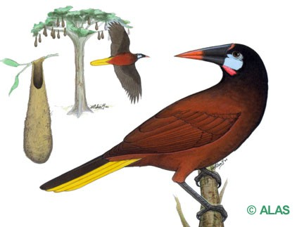

```{r setup, include=FALSE}
knitr::opts_chunk$set(echo = TRUE)
```

\
\
\
\
 <center>**Oropéndola de Montezuma (*Psarocolius montezuma*)**<center>
\
\
\
\
 <center><center>
\
\
 <p align="justify">
 **Descripción**: Son aves que pueden medir entre 50cm y 32cm, con un peso aproximado de entre 520g y 230g, se suelen distinguir de otras oropéndolas por su piel pálida de la cara, presentan ojos oscuros y picos con la punta anaranjada, su cabeza, cuello y pecho negros; el resto de su cuerpo es color marrón castaño (Stiles & Skutch, 2007).
Los machos suelen ser marrón más oscuro en comparación con las hembras, poseen un color azul en sus mejillas, la base que rodea el casquete es anaranjada y la base de la mandíbula es rosa (Stiles & Skutch, 2007).
</p>
\
\
<p align="justify">
**Distribución**: Son residentes de toda la vertiente Caribe, Pacífico Central, Cordillera de Guanacaste, Cordillera de Tilarán, Cordillera Volcánica Central, Valle Central, su distribución va del S de México hasta el centro de Panamá (Bolaños, 1830). 
</p>
\
\
<p align="justify">
**Hábitat**: Anidan en colonias densas en árboles aislados en claros o áreas parcialmente despejadas, suelen volar en bandadas dispersas compuestas por gran cantidad de individuos. Para su anidación escogen árboles generalmente altos y anchos (Stiles & Skutch, 2007).
</p>
\
\
<p align="justify">
**Bibliografía**

Bolaños, Silvia. (1980). Ecobiosis, Museo Nacional. Recuperado de http://ecobiosis.museocostarica.go.cr/especies/ficha/2/3951

Stiles, F. G., & Skutch, A. F. (2007). Guía de aves de Costa Rica. Editorial INBio.
</p>
