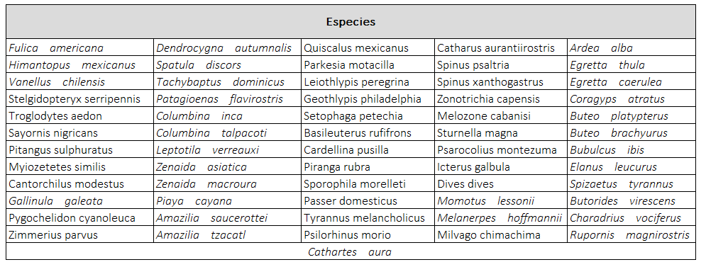
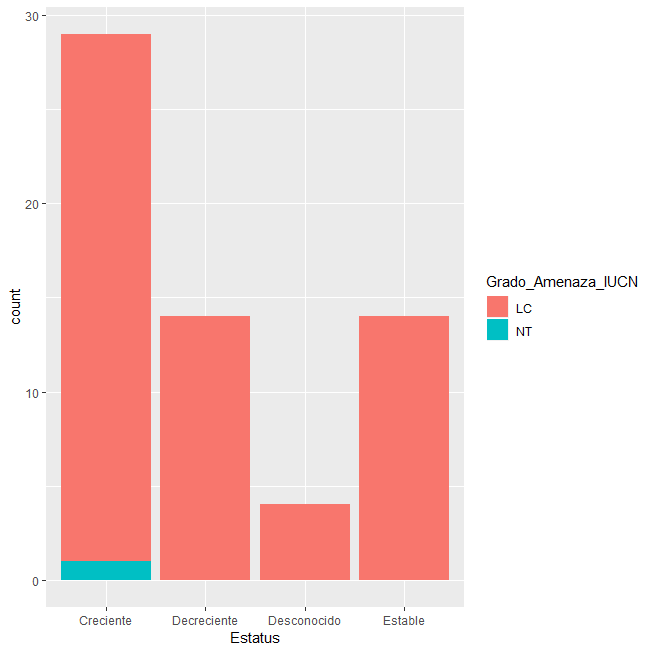

```{r setup, include=FALSE}
knitr::opts_chunk$set(echo = TRUE)
```

\
\
\
\

 <center>**Lista de especies observadas**<center>

\
\


<center></center>

\
\
\
\


<center>**Estatus y Grado de Amenaza según IUCN**<center>
\
\
\
\
<p align="left"></p>
<p align="left">
Figura 1
</p>
\
\
\
<p align="justify">
Como se muestra en la Figura 1, las 61 especies observadas durante la gira se encuentran dentro de los grados de amenaza LC y NT, según los Criterios de la Lista Roja deben ser aplicados a un taxón basándose en la evidencia disponible respecto a su abundancia, tendencias y distribución, a continuación se definen los grados LC y NT: 
</p>

<p align="justify">
**Preocupación menor (LC)**: Un taxón se considera de Preocupación Menor cuando, habiendo sido evaluado, no cumple ninguno de los criterios que definen las categorías de En Peligro Crítico, En Peligro, Vulnerable o Casi Amenazado. Se incluyen en esta categoría taxones abundantes y de amplia distribución (UICN, 2012).
</p>

<p align="justify">
**Casi amenazado (NT)**: Un taxón está Casi Amenazado cuando ha sido evaluado según los criterios y no satisface, actualmente, los criterios para En Peligro Crítico, En Peligro o Vulnerable, pero está próximo a satisfacer los criterios, o posiblemente los satisfaga, en un futuro cercano (UICN, 2012).
</p>
<p align="justify">
El sistema de categorías y criterios de la Lista Roja de la UICN genera una fácil compresión para clasificar especies según su riesgo de extinción a nivel global, aunque esta Lista Roja se enfoca sobre los taxones que se encuentran en mayor riesgo, no constituye el único medio de establecer prioridades para su conservación (UICN, 2012).
</p>

\
\

<p align="justify">
**Bibliografía** 

UICN. (2012). Categorías y Criterios de la Lista Roja de la UICN: Versión 3.1. Segunda edición. Gland, Suiza y Cambridge, Reino Unido: UICN. vi + 34pp. Originalmente publicado como IUCN Red 
</p>
