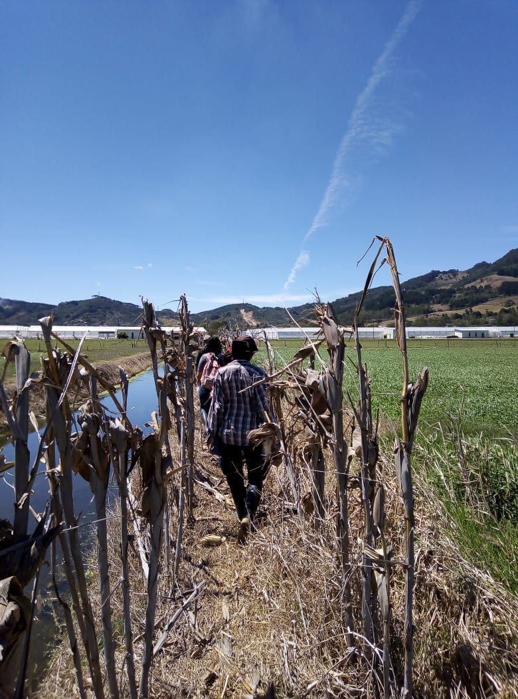

**Rodríguez-García.D & Corella-Esquivel.L**

**Marzo, 2019**

**Ubicación**: Se encuentra localizada en el Valle del Guarco, en la región central de Costa Rica. Geográficamente está a una altitud de 1,435 m sobre el nivel del mar, en las faldas del Volcán Irazú, a 24 km al sureste de la ciudad de San José.

En el lugar de observación de aves encontramos diferentes cultivos como; moras silvestres y moras de exportación, gandul un tipo de frijol de palo el que cual utilizan como barrera rompe vientos, también había plantaciones de diferentes cítricos. Además de granjas porcinas.  

\
\
\

\
\
\
\

\
\
\

